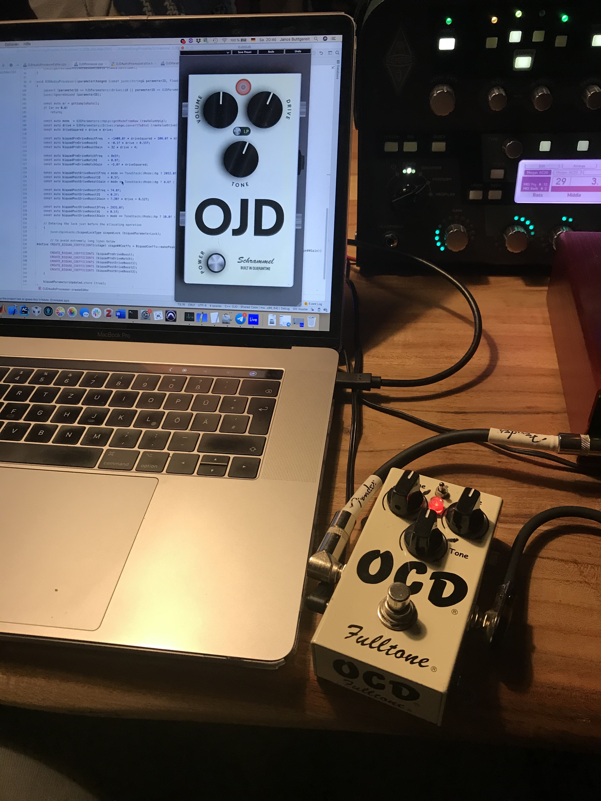

# Schrammel OJD - Model of a modern classic guitar distortion pedal

Hi! My name is Janos, I like playing e-guitar & tweaking my guitar pedalboard as a hobby, I'm working as an audio software programmer and studied electrical engineering. Coming from this background, I thought that the (guitar/audio) world would need a good sounding, good looking & open source guitar distortion plugin. 

So... May I introduce to you: The Schrammel OJD. Heavily inspired by the schematics of a modern classic analog pedal, digitally built with my favourite C++ framework [JUCE](https://juce.com). Below, you'll find some information on how you get the plugin and – if you are an audio software geek like me – how the analog modeling approach I used here works.

Just add it to your FX chain before your digital amp simulation of choice and get that distortion sound that simply fits the mix perfectly.

## How to get the OJD? 🤷‍♀️🤷‍♂️

Beta version 0.9.5 out now! Go [here](https://github.com/JanosGit/Schrammel_OJD/releases/tag/0.9.5) and download it for free. Feeback welcome! 

The OJD is available for Mac OS and Windows as VST3, AAX and AU (Mac OS only) plugin. You'll find the installer for the latest version here:

TBA

The OJD is a free open source plugin, there is no license key required. If you however like the OJD as I do, I would be glad if you considered donating a small amount of momey over here: 

TBA

If you are familiar with all those software development stuff, you can of course build your own version from sources. You'll find information on that on the end of this page.

## Why does it look so nice? 🤩
The OJD wouldn't be halfway as cool as it is, if my good friend bandmate and skilled graphics designer [Henning Oskamp](http://www.henningoskamp.de) wouldn't have created such good looking vector-graphic GUI elements.

Fun fact: The brand name "Schrammel" actually dates back to when we started making music together in school and had big plans on modding and building amps and guitars under that brand name. So to us it was clear, that we need to bring "Schrammel" back to life the first guitar product we'll ever release.

## How does it sound? 🎸🎸

Under this link, you'll get some impressions of the sound I recorded in the late prototyping stage. You will see how I switch between the OJD and an analog distortion pedal. Do you even notice a difference? Which one is your favorite?

TBA

## How does the modeling part work?

Ok this is for the people out there that at least have basic knowledge in digital signal processing and (audio) electronics. 

### Which modeling approach to chose?
There are various approaches on how to model analog audio circuits with digital signal processing. They can be more or less grouped into three groups:

#### 1. Component based or "White Box" modeling

This is the most straightforward modeling approach that can be applied if you have deep knowledge on the circuit you want to model. As in theory every circuit can be fully calculated in every state if you know all parameters of the components involved, it is possible to use this approach to compute how a certain circuit would react to a certain input signal. However, everyone who ever simulated a circuit with simulation tools like e.g. Spice, knows that this can take some amount of time for medium complex circuits. Furthermore, everyone that ever tried to apply those Spice simulation results with a real world circuit will have noticed that this sometimes works better and sometimes worse. Especially complex non-linear circuits are crazily complex to compute. Bad news: Non-linearities are one of the key aspects that make analog audio hardware sound so nice... So a component-based modeling approach will always require a deep understanding of the circuit, that makes it possible to spot the parts that are crucial for the sound and to simplify parts of the circuit that won't make any noticeable difference anyway. When it comes down to the pure math, there are different mathematical approaches on how to compute a circuit in general – my knowledge in this field is still quite limited.

#### 2. Black Box modeling

A black box modeling approach knows nothing about the schematics. You typically assume a basic block-diagram of the signal flow that originates from the knowledge about the typical structure of the device you want to model, e.g. for a distortion pedal like this one could assume something like filter -> gain -> non-linear waveshaper -> filter -> gain. While this abstract approach might simplify the DSP code a lot, it opens up two questions: How to derive all the parameters for the processing blocks from the original hardware? And what level of precision (e.g. filter orders) is needed to achieve a satisfying result (or can a satisfying result be achieved this way at all?). Regarding the second part, one could start with a massive over-precise approach and reduce precision step by step until the user notices a difference. Regarding the first part, this one gets especially difficult if the device has multiple control elements. Accurately capturing one specific setting is likely to be successful – this is the approach that products like the Kemper Profiling Amp rely on. But creating a model with interactive control elements that act together just like the original hardware does means that you would have to capture parameters in hundreds of combinations of parameters. This will be a tough to impossible task.

#### 3. "Grey Box modeling" – The best of both worlds

It is possible to combine both approaches. If the schematic is known, parts of a schematic that are highly interactive and parts of a schematic that are likely to not interact with the surrounding parts can be determined. This way, a black-box-like block diagram that groups (nearly) non interactive blocks can be created. We can then have a look if these blocks are e.g. linear, time-invariant or not and chose an appropriate modeling approach for each block. With the schematics at hand, it's furthermore possible to see which controls affect which block, which will make measurements under different settings far less complex.

### How did I do it?

My approach was the "Grey Box" approach. I started with looking for schematics that match the type of distortion that I tried to model. You'll find a lot of them on the internet, however a very nice one can be found [here](http://zadvitsky.com/index.php/projects/pedals/ocd-overdrive-diy.html). What makes this one so nice is the fact, that it already separates the three relevant parts of the circuit well. You can see that there is a preamp-section, followed by the clipping stage and a tone and output volume section at the end. 

This structure is very common to distortion pedals in general and one could build a very simple distortion by just concatenating a linear gain block with some simple clipping (e.g. a tanh function) and a low pass followed by another gain block. If you have some software like e.g. Max MSP at hand you can easily try to build a processing chain like that and get an idea of how it sounds. While the result will definitely be some kind of distortion effect, it will likely not satisfy your ears as much as a good guitar overdrive. This is mainly based on the fact, that a simple gain before the clipping stage and a simple lowpass behind it doesn't model the structure of real analog distortion very well. Instead, you will notice that most of the distinct sound of an analog distortion origins from a unique frequency response of the pre-clipping stage block and another unique frequency response of the post-clipping stage. So we better try to describe both stages as a somewhat complex filter function whose transfer function is dependent on the settings of some knobs.

But how can we measure the pre- and post clipping frequency response individually? The trick is to crank up the distortion to a max to create something like a perfect rectangle signal as the clipping stage output. In this state, the impact of the pre-clipping frequency response is nearly negligible. We can then use sine sweeps to measure the output response to certain input frequencies. In a second run, the gain is set to a minimum and the input signal is lowered to an amount where there is nearly no clipping. With a spectral analyzer, we can try to keep the harmonic spectrum generated for a sine input as low as even possible. If we now measure the frequency response again, we will measure the addition of the input and output response. As we already know the output response, we can now subtract it from the combined response and derive the resulting response from that.

This is what I did for this project. Assuming that the output volume is a simple linear gain, I measured the responses for quite a lot of combinations of settings of the other three controls (Drive, Tone, HP/LP switch). Those measurements resulted in a set of frequency response curves that showed some distinct peaks. With the help of some matlab scripts, I managed to approximate their center frequency and gain values in dependance on the control parameters with relatively simple polynomial functions. It turned out that the input gain control is no linear gain stage but more or less a set of biquads. The calculation of some of them is dependent on the setting of the HP/LP switch. The tone control turned out to be kind of a continuous blend between a high shelf and a low pass filter, which I managed to model with two simple first order filters. Their calculation also depends on the HP/LP setting. While I documented the polynomial functions I found quite well, unfortunately the original measurement data got lost over time, so I don't have anything fancy to show here. In the code, the biquad coefficient calculation according to the polynomial functions is performed in the `OJDAudioProcessor::parameterChanged` callback when the Drive or HP/LP parameter changes. The two first order filters used for the Tone control are grouped into the separate class `ToneStack`.

Having talked a lot about filters, the second and somewhat most important part of a distortion is the clipping stage. In hardware, this is usually done by a pair of anti-parallel diodes that limit the voltage and therefore lead to a clipping effect. The selection of the diodes controls the clipping curve and there are a lot of different diode types which all create a different curve and therefore lead to a different clipping characteristic. In the original schematics, we see that mosfets – which is quite special. The interesting bit here is, that actually the protection diodes of the mosfets are used as clipping diodes. One of the two mosfets is wired in series with another germanium diode, which causes an additional voltage drop on that side, which leads to an asymmetric clipping curve. Asymmetric clipping curves tend to produce more even harmonics which some people consider as pleasant and especially tube amps show an asysmetric clipping behaviour, so this configuration should lead to a more tube-like behaviour – at least that is what manufacturers say.

The clipping curve of that special diode/mosfet configuration can be simulated well in spice. The resulting curve can then be approximated by a more or less mathematical function. The resulting curve I found could be approximated well by two quadratic functions and two hard upper and lower limits. You find this in the constructor of the `Waveshaper` class. This is then fed into a JUCE `dsp::Waveshaper` instance for more efficient computation and is computed with 16 times oversampling to avoid aliasing artifacts.

That's it, roughly. As a final step, some parameters were then fine-tuned by ear until I had a hard time myself to distinguish between the hardware unit an my plugin 🙃

One last note: There are a lot of variations on the schematics and pedal I used as a reference out there. As there are noticeable sound differences between two hardware units, there are most likely also noticeable sound differences between your pedal and my plugin. However, I think that this plugin really feels like it could be one of these hardware units with a great and authentic sound, which is what I was aiming for.

## How to build the plugin from source

The project is based on a CMake build script. If you are familiar with CMake, building the plugin should be as much as two commands on your command line or one click in a CMake capable IDE like e.g. CLion. Detailed information TBA
