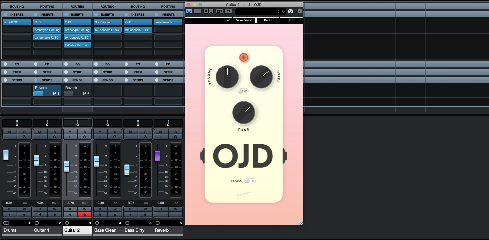

 

# Schrammel OJD - Model of a modern classic guitar overdrive pedal

Hi! My name is Janos, I like playing e-guitar & tweaking my guitar pedalboard as a hobby, I'm working as an audio software programmer and studied electrical engineering. Coming from this background, I thought that the (guitar/audio) world would need a good sounding, good looking & open source guitar overdrive plugin. 

So... May I introduce to you: The Schrammel OJD. Heavily inspired by the schematics of a modern classic analog pedal, digitally built with my favourite C++ framework [JUCE](https://github.com/juce-framework/JUCE).

Just add it to your FX chain before your digital amp simulation of choice and get that distortion sound that simply fits the mix perfectly.

## License
The OJD is licensed under a [GPLv3](https://www.gnu.org/licenses/licenses.en.html#GPL) license. This license applies to all parts of this repository except for 
- The external third party dependencies that can be found as git submodules in the `Ext` subdirectory and contain their own license information. These licenses are all GPLv3 compatible, so the OJD as a combined product is under GPLv3 license
- The Windows installer, found in the `Deployment/Windows` subdirectory, which is licensed under a [LGPLv3](https://www.gnu.org/licenses/licenses.en.html#LGPL) license as the distributed versions of the installer will contain the closed source Microsoft Visual C++ redistributable runtime library installer

## How to get the OJD? 🤷‍♀️🤷‍♂️

The plugin is currently in a late, mostly stable beta phase. To download the latest build, go to [my website](https://schrammel.io) and download it for free or alternatively browse the releases directly here on GitHub. Feeback is welcome, you can reach me via the contact via my website or post issues here on GitHub! 

The OJD is currently available for Mac OS and Windows as VST3 and AU (Mac OS only) plugin. I'm working on getting AAX signing up & running to also release an AAX version in the near future.

## Thank goes out to...
1. My long time good friend and band mate [Henning Oskamp](http://www.henningoskamp.de) for his incredible work on the user interface and website design. The plugin would not look half as good if I had tried designing it ❤️
2. My employer [sonible](https://www.sonible.com) for supporting me to work on open source projects beneath my job and for promoting this project through a [blog article](https://www.sonible.com/blog/ojd-open-source-plugin/)
3. [JetBrains](https://www.jetbrains.com/?from=schrammel_ojd), a company that builds IDEs that are superior to any other option that I tried out there. I'm very thankful that they support this project with a free license for their CMake IDE Clion!

<a href="https://www.jetbrains.com/?from=schrammel_ojd">

## How to build the plugin from source

The OJD is a free open source plugin, there is no license key required. Beneath downloading the ready-to-use installers, you can always build it yourself from sources if you are familiar with all those software development stuff. The project is based on a CMake build script.

There are various ways to build a CMake-based project. For all of them you need CMake being installed on the system, along with suitable platform specific build tools – I currently use the XCode 12.2 toolchain for macOS builds and Visual Studio 2019 with the clang-cl compiler for Windows. Furthermore Rust build tools need to be installed to build the resvg rendering engine which is included as submodule into this project.

### Use a CMake capable IDE
On Windows you can directly open the CMake project in Visual Studio 2019. When doing so, Visual Studio will create a project based on the ninja build system for you automatically and you can compile and work with it just like you would do with a ususal Visual Studio solution.

For macOS, Linux and of course also for Windows you can use Jet Brains CLion IDE, which is what I use for the development of the plugin myself

### Do it all from the command line
Of course, you don't even need to open an IDE to build the plugin. You can trigger the build completely from the command line and give CMake the freedom to chose whatever it sees as the suitable default generator for your platform. Type in 
`cmake -DCMAKE_BUILD_TYPE=Release -B build`
to configure a release build in the `build` subdirectory and then call
`cmake --build build`
to let CMake start the build it configured in the previous step.

This is basically how I trigger the builds for my GitHub actions based build pipeline used to build the plugin that you download. For more details look into the `.github/workflows/build.yml` file.

### (Currently unsupported) Generate an IDE project
CMake allows you to create projects for various IDEs from the `CMakeLists.txt`. If you want to build the project with Xcode or JetBrains AppCode on MacOS, open up a terminal and type in

`cmake -G Xcode -B build` This creates an XCode project from CMake. After running that command you'll find an XCode project into the build subfolder folder that can be used to build the plugin. Of course you can chose a different name or path for the `build` folder.

Note: As I don't use this option myself it seems broken with the resvg compilation target. I'm open to any pull requests fixing this, but it's not a high priority thing for me personally.
